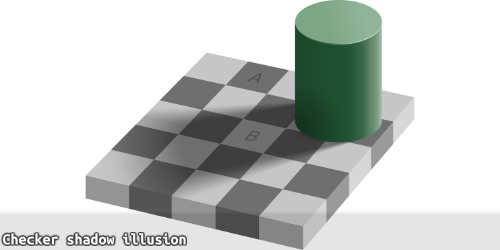

# 色彩 Color

## 主题色

每一组主题色定义三种变体：

| 环境变量  | 全局变量（主题：rasp） | 名称                                 |
| --------- | ---------------------- | ------------------------------------ |
| `---main` | `--rasp-main`          | 主色                                 |
| `---ink`  | `--rasp-ink`           | 前景色, 高对比, 在深色模式会变得很亮 |
| `---foam` | `--rasp-foam`          | 淡色, 主色的半透明, 装饰             |

环境变量由 `tone:rasp` 的 CSS 类提供，简写的方式能让组件颜色可配置。若没有这个需求，则可以用全局变量代替

:::demo design/Color
:::

## 全局基本色

每一组前景色定义三种变体：

|                 |     |                  |
| --------------- | --- | ---------------- |
| `--mat-air-0`   |     | 透明             |
| `--mat-air-05`  |     | 不显眼底灰       |
| `--mat-air-1`   |     | 1 级灰           |
| `--mat-air-15`  |     | 边框灰           |
| `--mat-air-2`   |     | 2 级灰           |
| `--mat-air-3`   |     | 3 级灰           |
| `--mat-air-4`   |     | 4 级灰           |
| `--mat-solid-0` |     | 不透明，以此类推 |

:::demo design/ColorGlobal
:::

每一组前景色定义三种变体：

|            |     |                          |
| ---------- | --- | ------------------------ |
| `--text-1` |     | 区域内采用的字体颜色     |
| `--text-2` |     | 区域内采用的次级字体颜色 |
| `--text-3` |     | 区域内采用的低调字体颜色 |

:::demo design/ColorForeGround
:::

## 材质

材质定义了盒如何反射光源。

:::demo design/ColorMat
:::

## Misc

### 可读性

使用下列工具检查颜色的对比度：

https://ruitina.com/apca-accessible-colour-contrast/

https://contrast.tools/

高对比度对长期阅读有利，但无法明示焦点；工具仅供参考。

### 深色模式

在深色模式下，主色的亮度和饱和度需要可观提升，以达到和明亮环境相同的视觉效果。

