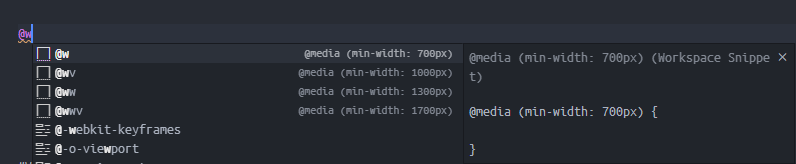

# Breakpoints

宽度断点及常用设备：

| Pixel      | Device                    | Breakpoint | Note             |
| ---------- | ------------------------- | ---------- | ---------------- |
| 320px      | ~~iPhone5~~               |            |                  |
| 360px      | Galaxy S22 (3x)           |            |                  |
| 375px      | iPhone SE (2x)            |            |                  |
| 393px      | iPhone 15 (3x)            |            |                  |
| 430px      | iPhone 15 Pro Max (3x)    |            |                  |
| 444px      |                           | v          |                  |
| 450px      | Desktop Firefox           |            |                  |
| 500px      | Desktop Google Chrome     |            |                  |
| **700px**  |                           | **w**      | **平板分界线**   |
| 744px      | iPad Mini 6 (2x)          |            |                  |
| 768px      | iPad Mini 4 (2x)          |            |                  |
| 1000px     |                           | wv         |                  |
| 1024px     | iPad Mini 4 (2x)          |            |                  |
| 1133px     | iPad Mini 6 (2x)          |            |                  |
| 1280px     | HD                        |            |                  |
| **1300px** |                           | **ww**     | **笔记本分界线** |
| 1366px     | iPad Pro 12.9' (6th) (2x) |            |                  |
| 1366px     | 13' Laptop                |            |                  |
| 1700px     |                           | wwv        |                  |
| 1920px     | FHD                       |            |                  |
| 2560px     | 2K                        |            |                  |

比例图示：

<BreakpointsA />

## Usage

CSS 媒体查询主要为 vscode 用户片段。

其中，`w` 和 `ww` 为 **CSS 预设会考虑支持的断点前缀** （使用方法 `px-2 w:px-4 ww:px-6` 表示 padding 会根据设备宽度逐渐变大），具体能不能支持，需参照接下来每个页面的介绍。

除了 `w` 和 `ww`， 所有都 支持 vscode 用户片段。

由于 `w` 作为单个字符已经被使用，“半个 w” 用 `v` 表示。

