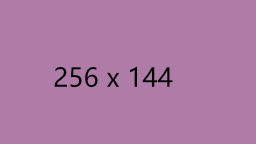

# Reset

本章节解释 `strawberry-farm` 如何重置样式表。

## Box Sizing

```css
*,
*::before,
*::after {
  box-sizing: border-box;
}
```

## Img

```scss
img {
  max-width: 100%; // For images to not be able to exceed their container
  max-height: 100%;
  object-fit: contain;
}
```

考虑以下示例：

```html
<div style="width: 50px; border: 5px dashed #8883">
  
</div>
```

<div style="width: 50px; border: 5px dashed #8883">
  
</div>

如果重置为默认值，则图片元素会越出容器。

```html
<div style="width: 50px; border: 5px dashed #8883">
  
</div>
```

<div style="width: 50px; border: 5px dashed #8883">
  
</div>

注： `<video />` 元素同理。

## Table

```scss
table {
  border-collapse: collapse;
}
```

## Typography

仅在 `article` 角色或元素内，恢复默认 `margin` 。

```scss
// Remove default margin
:where(h1, h2, h3, h4, h5, h6, p, figure, blockquote, dl, dd) {
  margin: 0;
}

:where(ul, ol) {
  list-style: none;
  margin: 0;
  padding: 0;
}

// Restore default margin and list style inside an article element
:where(article, [role='article'])
  :where(h1, h2, h3, h4, h5, h6, p, figure, blockquote, dl, dd) {
  margin-block: 1em;
}

:where(article, [role='article']) :where(ul) {
  list-style: disc;
  margin-block: 1em;
  margin-inline-start: 40px;
}

:where(article, [role='article']) :where(ol) {
  list-style: decimal;
  margin-block: 1em;
  margin-inline-start: 40px;
}
```
