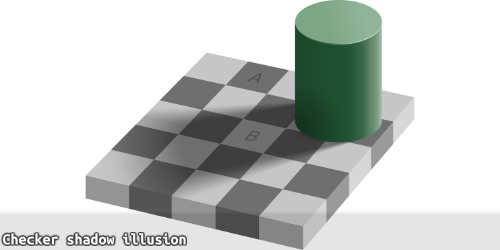

# 色彩 Color

## 主题色

每一组主题色定义三种变体：

| 环境变量  | 全局变量（主题：pink） |      |                                          |
| --------- | ---------------------- | ---- | ---------------------------------------- |
| `---fore` | `--pink-fore`          |      | 空白背景下的前景色，用于文本，较主色更深 |
| `---main` | `--pink-main`          | 主色 | 用于次要文本或仅装饰作用                 |
| `---foam` | `--pink-foam`          | 淡色 | 仅装饰作用                               |

环境变量由 `tone:pink` 的 CSS 类提供，简写的方式能让组件颜色可配置。若没有这个需求，则可以用全局变量代替

:::demo design/Color
:::

## 基本色

每一组前景色定义三种变体：

|              |          |                                                      |
| ------------ | -------- | ---------------------------------------------------- |
| `---text1`   |          | 区域内采用的字体颜色，必填，以应对主题嵌套的情况     |
| `---text2`   |          | 区域内采用的次级字体颜色，必填，以应对主题嵌套的情况 |
| `---text3`   |          | 区域内采用的低调字体颜色，必填，以应对主题嵌套的情况 |
| `---idle`    | 主色     | 常态背景色                                           |
| `---pending` | 备选项目 | 标识区域处于备选状态下的背景色                       |
| `---active`  | 激活项目 | 标识区域处于激活状态下的背景色                       |

### 可读性

使用下列工具检查颜色的对比度：

https://ruitina.com/apca-accessible-colour-contrast/

https://contrast.tools/

高对比度对长期阅读有利，但无法明示焦点；工具仅供参考。

### 深色模式

在深色模式下，主色的亮度和饱和度需要可观提升，以达到和明亮环境相同的视觉效果。

